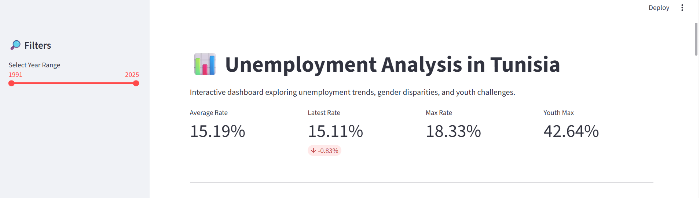
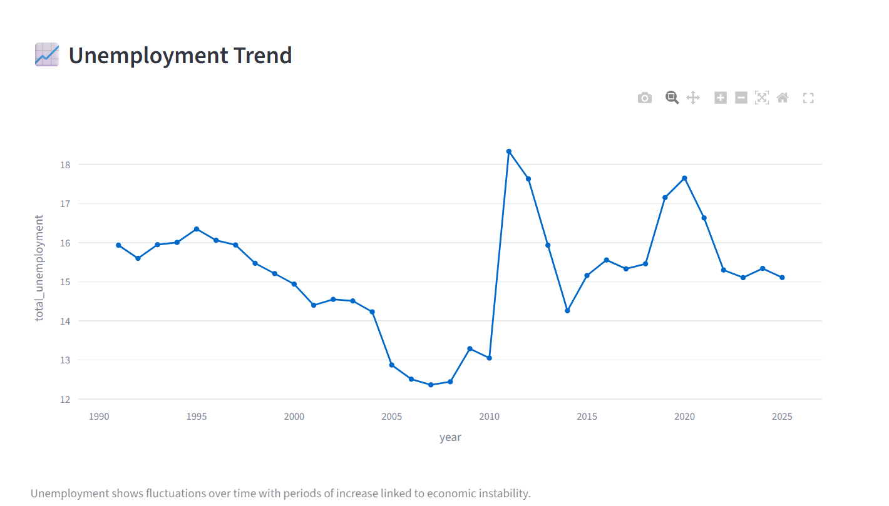
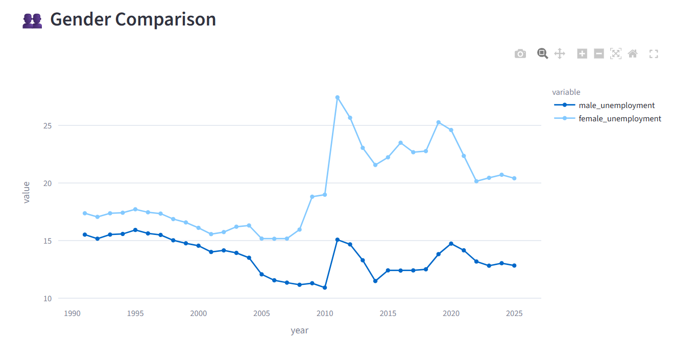

# Tunisia Unemployment Analysis Dashboard

##  Project Overview
This project analyzes unemployment trends in Tunisia using World Bank data.  
It aims to uncover long-term labor market patterns, with a focus on:

- Youth unemployment
- Gender disparities
- Overall unemployment evolution

The goal is to transform raw economic data into **clear, interactive insights** that support data-driven understanding of Tunisia’s labor market.

---

## Problem Statement
Tunisia faces persistent unemployment challenges, especially among young people and women.  
This project investigates:

- Is unemployment increasing or stable over time?
- Are there structural inequalities between men and women?
- Why is youth unemployment significantly higher?

---

##  Tools & Technologies
- Python
- Pandas
- Plotly
- Streamlit

---

## 📊 Key Insights

- 📈 Unemployment shows long-term fluctuations with periods of increase linked to economic conditions  
- 🎓 Youth unemployment is consistently significantly higher than total unemployment  
- 👥 Female unemployment is generally higher than male unemployment  
- ⚖️ The gap between youth and total unemployment indicates structural labor market issues  

---

##  Dashboard Features

- Interactive filtering by year range
- KPI summary cards
- Time-series visualizations
- Gender comparison analysis
- Youth unemployment analysis
- Dynamic computed insights

---

##  Dashboard Preview








##  Live Demo
👉 [https://link.streamlit.app](https://unemployment-tunisia-dashboard-f4jzfkohdmlwugeg4s2kof.streamlit.app/)

---

##  How to Run Locally

```bash
pip install -r requirements.txt
streamlit run app/streamlit_app.py


ritej – Data Analyst Portfolio Project
